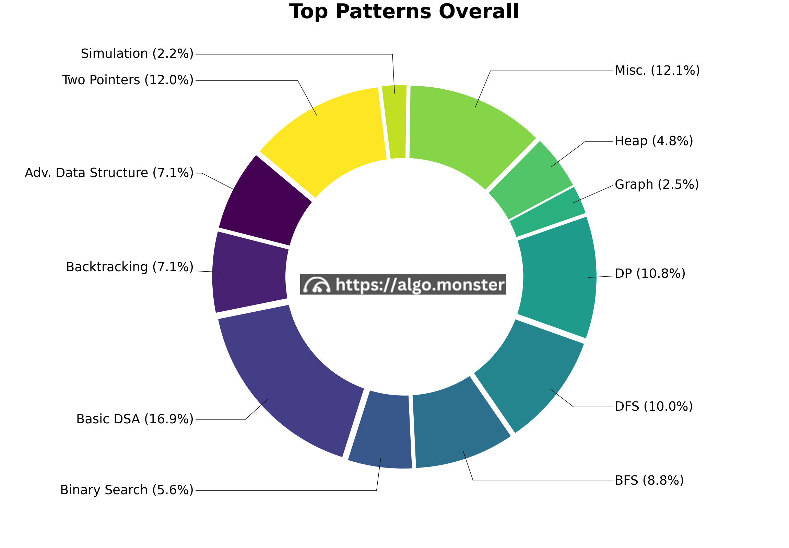

# Overall Coding Patterns

## Highest ROI
1. DFS (Tree to Graph)
2. BFS
3. Two Pointers

## Get through Easy Questions
Basic DSAs include: Linked List, Array, Hash Map, Stack, Queue, Sorting.

## Priority Queue / Heap medium ROI
Classic problems: Median of data stream, kth closest point

## Greedy, DP
House Robber, Robot Paths. If cant figure out, use DFS + memoization.

# Math
Aritmethic Sequences - Sequences with a constant difference between consecutive terms.
- e.g. 1, 2, 3, 4, 5 (difference is 1)
- e.g. 2, 4, 6, 8, 10 (difference is 2)
- Sum of aritmethic sequence: n * (first term + last term) / 2

Geometric Sequences - Sequences with a constant ratio between consecutive terms.
- e.g. 2, 6, 18, 54 (ratio is 3)
- Sum of geometric sequence: a * (1 - r^n) / (1 - r), where a is the first term, r is the common ratio, n is the number of terms.

# Keywords to Algorithms

## "Top k"
- Heap: K closest points

## "How many ways.."
- DFS: Decode ways
- DP: Robot paths

## "Substring"
- Sliding window: Longest substring without repeating characters

## "Palindrome"
- two pointers: Valid Palindrome
- DFS: Palindrome Partitioning
- DP: Palindrome Partitioning II

## "Tree"
- shortest, level-order
    - BFS: Binary Tree Level-Order Traversal
- else: DFS: Max Depth

## "Parentheses"
- Stack: Valid Parentheses

## "Subarray"
- Sliding window: Maximum subarray sum
- Prefix sum: Subarray sum
- Hashmap: Continuous subarray sum

## Max subarray
- Greedy: Kadane's Algorithm

## "X Sum"
Two pointer: Two sum

## "Max/longest sequence"
- Dynamic programming, DFS: Longest increasing subsequence
- mono deque: Sliding window maximum

## "Minimum/Shortest"
- Dynamic programming, DFS: Minimal path sum
- BFS: Shortest path

## "Partition/split ... array/string"
- DFS: Decode ways

## "Subsequence"
- Dynamic programming, DFS: Longest increasing subsequence
- Sliding window: Longest increasing subsequence

## "Matrix"
- BFS, DFS: Flood fill, Islands
- Dynamic programming: Maximal square

## "Jump"
- Greedy/DP: Jump game

## "Game"
- Dynamic programming: Divisor game, Stone game

## "Connected component", "Cut/remove" "Regions/groups/connections"
- Union Find: Number of connected components, Redundant connections

## Transitive relationship

If the items are related to one another and the relationship is transitive, then chances are we can build a graph and use BFS or Union Find.

- string converting to another, BFS: Word Ladder
- string converting to another, BFS, Union Find: Sentence Similarity
numbers having divisional relationship, BFS, Union Find: Evaluate Division

## "Interval"

Greedy: sort by start/end time and then go through sorted intervals Interval Pattern