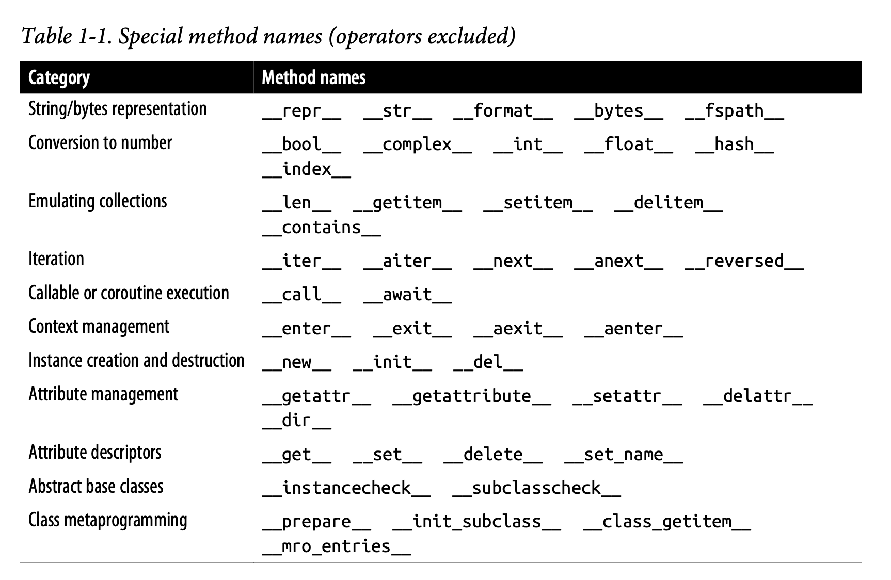
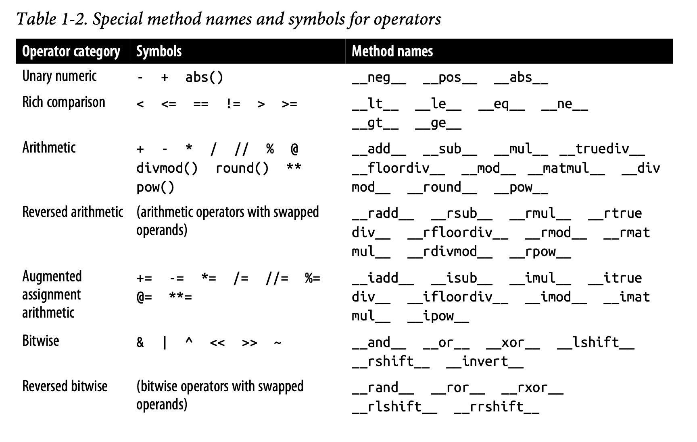

## Special Methods (dunders)

### Built-in Sequences
- Container sequences  
Can hold items of different types, including nested containers. Some examples:
list, tuple, and collections.deque.
- Flat sequences:  
Hold items of one simple type. Some examples: str, bytes, and array.array.